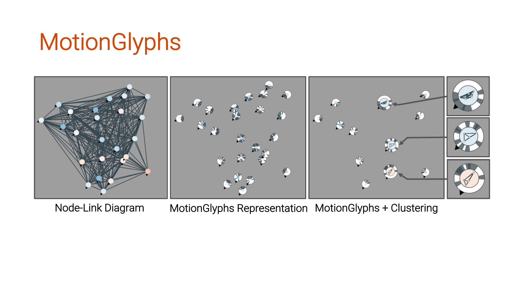

MotionGlyphs
============================================
Visual Abstraction of Spatio-Temporal Networks in Collective Animal Behavior
<p align="center">
  
</p>
  
### Abstract
<p align="justify">
Domain experts for collective animal behavior analyze relationships between single animal movers and groups of animals over time and space to detect emergent group properties. A common way to interpret this type of data is to visualize it as a spatio-temporal network. Collective behavior data sets are often large, and may hence result in dense and highly connected node-link diagrams, resulting in issues of node-overlap and edge clutter. In this design study, in an iterative design process, we developed glyphs as a design for seamlessly encoding relationships and movement characteristics of a single mover or clusters of movers. Based on these glyph designs, we developed a visual exploration prototype, MotionGlyphs, that supports domain experts in interactively filtering, clustering, and animating spatio-temporal networks for collective animal behavior analysis. By means of an expert evaluation, we show how MotionGlyphs supports important tasks and analysis goals of our domain experts, and we give evidence of the usefulness for analyzing spatio-temporal networks of collective animal behavior.</p>

_This repository provides a JavaScript implementation of MotionGlyphs prototype as described in the paper:_

```bibtex
@article{CaScBu+2020MotionGlyphs,
    author = {Cakmak, Eren and Schäfer, Hanna and Buchmüller, Juri and Fuchs, Johannes and Schreck, Tobias and Jordan, Alex and Keim, Daniel A.},
    journal = {Computer Graphics Forum},
    number = {3},
    title = {MotionGlyphs: Visual Abstraction of Spatio-Temporal Networks in Collective Animal Behavior},
    volume = {39},
    year = {2020}
}
```

## Online Demo

The prototype is online: __[Demo](https://glyph.dbvis.de/)__

### How to locally install

First, install the `node.js` modules and run wepack.

```
    > npm install
    > npm run watch
```

After that, start a webserver of your choice and move  generated project `dist` folder

### Datasets

The following datasets are avaiable:

* `fish-5.csv` a part of real-world lab experiment with five stickleback fish
* `data-1.csv` artificially generate data with the Reynolds model
* `data-2.csv` artificially generate data with the Couzin model
* `data-3.csv` artificially generate data with the Reynolds model and clusters
* `fish-151.csv` a part of a real-world lab experiment with 151 golden shiner fish

The datasets were preprocessed and clustered with the following packages:

* [Movekit](https://github.com/dbvis-ukon/movekit)
* [ST-DBSCAN](https://github.com/eren-ck/st_dbscan)
* [ST-OPTICS](https://github.com/eren-ck/st_optics) - the usage of the package is optional

## License
Released under MIT License. See the [LICENSE](LICENSE) file for details.
The package was developed by Eren Cakmak from the [Data Analysis and Visualization Group](https://www.vis.uni-konstanz.de/) and the [Department of Collective Behaviour](http://collectivebehaviour.com) at the University Konstanz funded by the Deutsche Forschungsgemeinschaft (DFG, German Research Foundation) under Germany's Excellence Strategy – EXC 2117 – 422037984.